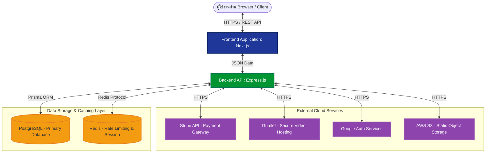
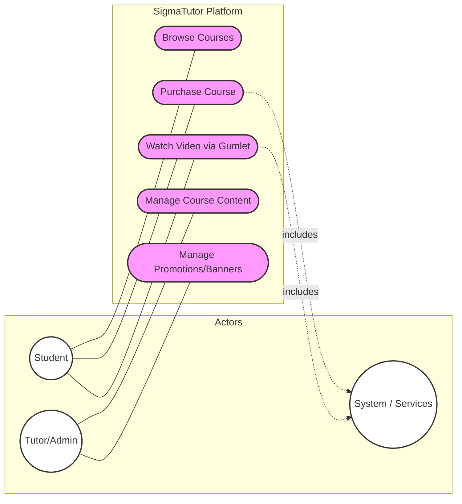
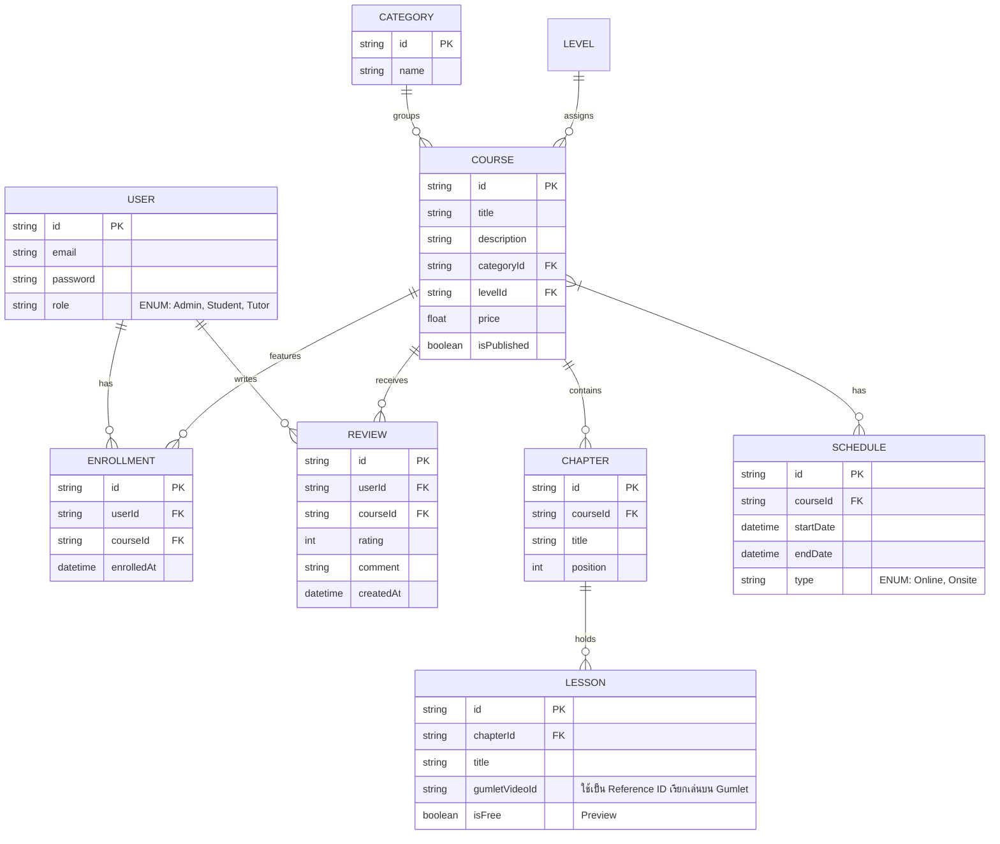

# หน้าปก (Cover Page)

**เอกสารการออกแบบระบบ (System Design Document)**  
**ชื่อโครงงาน:** ระบบจัดการการเรียนการสอนออนไลน์และออนไซต์ SigmaTutor Platform  
**กลุ่มที่:** 1  

**จัดทำโดย:**  
1. รหัสนักศึกษา [ใส่รหัสนักศึกษาที่ 1] ชื่อ-นามสกุล [ใส่ชื่อ-นามสกุลที่ 1] บทบาท: [ใส่บทบาท เช่น Project Manager / System Analyst]
2. รหัสนักศึกษา [ใส่รหัสนักศึกษาที่ 2] ชื่อ-นามสกุล [ใส่ชื่อ-นามสกุลที่ 2] บทบาท: [ใส่บทบาท เช่น Frontend Developer]
3. รหัสนักศึกษา [ใส่รหัสนักศึกษาที่ 3] ชื่อ-นามสกุล [ใส่ชื่อ-นามสกุลที่ 3] บทบาท: [ใส่บทบาท เช่น Backend Developer]
4. รหัสนักศึกษา [ใส่รหัสนักศึกษาที่ 4] ชื่อ-นามสกุล [ใส่ชื่อ-นามสกุลที่ 4] บทบาท: [ใส่บทบาท เช่น Tester / QA]

*(หมายเหตุ: โปรดเรียงลำดับรหัสนักศึกษาจากน้อยไปมากให้ถูกต้องก่อนนำไปส่งในรูปแบบ PDF)*

---

# ประวัติการจัดทำเอกสาร (Document History)

| เวอร์ชัน | วันที่ | รายละเอียดการแก้ไข | ผู้จัดทำ |
|:---:|:---:|---|---|
| 1.0 | 7 มีนาคม 2569 | สร้างเอกสารการออกแบบระบบ (System Design Document) ฉบับแรก อ้างอิงตามข้อกำหนด ISO 29110 | ตัวแทนกลุ่มที่ 1 |

---

## สารบัญ (Table of Contents)
- [หน้าปก (Cover Page)](#หน้าปก-cover-page)
- [ประวัติการจัดทำเอกสาร (Document History)](#ประวัติการจัดทำเอกสาร-document-history)
  - [สารบัญ (Table of Contents)](#สารบัญ-table-of-contents)
  - [1. บทนำ (Introduction)](#1-บทนำ-introduction)
    - [1.1 วัตถุประสงค์ (Purpose)](#11-วัตถุประสงค์-purpose)
    - [1.2 ขอบเขต (Scope)](#12-ขอบเขต-scope)
    - [1.3 เอกสารอ้างอิง (References)](#13-เอกสารอ้างอิง-references)
  - [2. ภาพรวมของระบบ (System Overview)](#2-ภาพรวมของระบบ-system-overview)
  - [3. ข้อจำกัดในการออกแบบ (Design Constraints)](#3-ข้อจำกัดในการออกแบบ-design-constraints)
  - [4. สมมติฐานการออกแบบ (Design Assumptions)](#4-สมมติฐานการออกแบบ-design-assumptions)
  - [5. สถาปัตยกรรมระบบ (System Architecture)](#5-สถาปัตยกรรมระบบ-system-architecture)
  - [6. การออกแบบส่วนประกอบ (Component Design)](#6-การออกแบบส่วนประกอบ-component-design)
    - [6.1 โมดูลการยืนยันตัวตนและการเข้าถึง (Authentication \& Authorization Module)](#61-โมดูลการยืนยันตัวตนและการเข้าถึง-authentication--authorization-module)
    - [6.2 โมดูลระบบคอร์สและบทเรียน (Course Content Management Module)](#62-โมดูลระบบคอร์สและบทเรียน-course-content-management-module)
    - [6.3 โมดูลตะกร้าสินค้าและการชำระเงิน (Checkout \& Payment Integration Module)](#63-โมดูลตะกร้าสินค้าและการชำระเงิน-checkout--payment-integration-module)
    - [6.4 แผนภาพ Use Case ของระบบหลัก (System Core Use Cases)](#64-แผนภาพ-use-case-ของระบบหลัก-system-core-use-cases)
  - [7. การออกแบบฐานข้อมูล (Database Design)](#7-การออกแบบฐานข้อมูล-database-design)
  - [8. การออกแบบอินเทอร์เฟซ (Interface Design)](#8-การออกแบบอินเทอร์เฟซ-interface-design)
    - [8.1 มุมมองสำหรับผู้เรียนและผู้ใช้งานสาธารณะ (Public / Student View)](#81-มุมมองสำหรับผู้เรียนและผู้ใช้งานสาธารณะ-public--student-view)
    - [8.2 มุมมองสำหรับผู้ดูแลระบบ (Admin Operation View)](#82-มุมมองสำหรับผู้ดูแลระบบ-admin-operation-view)

---

## 1. บทนำ (Introduction)

### 1.1 วัตถุประสงค์ (Purpose)
เอกสารฉบับนี้จัดทำขึ้นเพื่อแสดงการออกแบบสถาปัตยกรรมและรายละเอียดทางเทคนิคของระบบ **SigmaTutor** ซึ่งเป็นแพลตฟอร์มสำหรับการเรียนการสอนที่มีทั้งรูปแบบออนไลน์และออนไซต์ (Hybrid Learning Platform) โดยเอกสารจะอธิบายถึงโครงสร้างของระบบ การทำงานร่วมกันของแต่ละส่วนประกอบ การออกแบบฐานข้อมูล และหน้าจออินเทอร์เฟซ เพื่อให้ทีมผู้พัฒนา (Developer) ผู้ทดสอบระบบ (Tester) และผู้จัดการโครงการ (Project Manager) มีความเข้าใจตรงกันและสามารถใช้เป็นแนวทางในการพัฒนาระบบ (Software Construction) ได้อย่างมีประสิทธิภาพตามมาตรฐานกระบวนการพัฒนาซอฟต์แวร์ ISO 29110

### 1.2 ขอบเขต (Scope)
ระบบ SigmaTutor ครอบคลุมการทำงานตั้งแต่ส่วนของผู้ใช้งานทั่วไป (ผู้เรียน) ที่สามารถค้นหารายวิชา สมัครเรียน และชำระเงิน ตลอดจนส่วนของผู้สอนและผู้ดูแลระบบ (Admin) ที่สามารถจัดการเนื้อหาบทเรียน (Courses, Chapters, Lessons) จัดการตารางสอน (Schedules) และจัดการเครื่องมือการตลาด (Banners & Promotions) โดยเอกสารนี้จะครอบคลุมภาพรวมสถาปัตยกรรมของ Frontend (Next.js), Backend (Express.js), การเชื่อมต่อฐานข้อมูล (PostgreSQL ผ่าน Prisma), Cache (Redis), และการใช้บริการภายนอก เช่น Stripe (ชำระเงิน) และ Gumlet (ระบบสตรีมมิ่งวิดีโอแบบปลอดภัย)

### 1.3 เอกสารอ้างอิง (References)
- **มาตรฐานกระบวนการพัฒนาซอฟต์แวร์:** ISO/IEC 29110 Systems and software engineering — Lifecycle profiles for Very Small Entities (VSEs). 
- **สถาปัตยกรรมโครงสร้างโค้ด:** Turborepo / pnpm workspace Documentation. [เข้าถึงได้ที่: https://turbo.build/repo/docs]
- **ระบบชำระเงิน:** เอกสารคู่มือ API ของ Stripe (Stripe Payment Gateway Integration). [เข้าถึงได้ที่: https://stripe.com/docs/api]
- **ระบบวิดีโอสตรีมมิ่ง:** เอกสารคู่มือ API ของ Gumlet (Secure Video Hosting). [เข้าถึงได้ที่: https://docs.gumlet.com/]
- **เอกสารภายในโปรเจกต์:** โครงสร้างฐานข้อมูล Prisma Schema (`prisma/schema/*.prisma`) ของโปรเจกต์ SigmaTutor

---

## 2. ภาพรวมของระบบ (System Overview)

SigmaTutor เป็นแพลตฟอร์มจัดการการเรียนการสอน (Learning Management System - LMS) ระดับองค์กรที่อำนวยความสะดวกให้ผู้เรียนสามารถเข้าถึงเนื้อหาการเรียนได้อย่างไร้รอยต่อ ระบบทำงานผ่านเว็บแอปพลิเคชัน (Web Application) ที่เน้นการตอบสนองที่รวดเร็วและมอบประสบการณ์ผู้ใช้ที่ดี (High Performance & UX)

**ฟังก์ชันหลัก (Core Features):**
- **การจัดการผู้ใช้งานและการยืนยันตัวตน (Authentication & Authorization):** รองรับระบบ JWT แบบกำหนดอายุ และ Google OAuth พร้อมระบบแบ่งบทบาทผู้ใช้ (Role-based Access Control: Admin, Tutor, Student)
- **การจัดการหลักสูตร (Course Management):** ผู้ดูแลระบบสามารถสร้างและกำหนดโครงสร้างวิชา (Levels & Categories) ตั้งแต่ระดับบทเรียน (Chapter) จนถึงตอนย่อย (Lesson) ได้ด้วยตนเอง
- **ระบบสตรีมมิ่งวิดีโอส่วนตัว (Private Video Streaming):** ระบบบูรณาการกับ **Gumlet** โดยตรง แทนที่การใช้บริการวิดีโอสาธารณะอย่าง YouTube เพื่อป้องกันการเข้าถึงคลิปวิดีโอโดยไม่ได้รับอนุญาต และรักษาความเป็นส่วนตัวของเนื้อหาวิชาเรียน
- **ระบบตะกร้าสินค้าและการชำระเงิน (Checkout & Payment Integration):** ชำระเงินค่าคอร์สเรียนผ่านระบบ Stripe ที่มีความน่าเชื่อถือระดับสากล พร้อมรองรับโค้ดส่วนลด (Coupon & Promotion)
- **ระบบจัดตารางสอน (Schedule Management):** รองรับการจัดการตารางสอนสำหรับการเรียนคลาสสดหรือออนไซต์ (On-site / Live-Online Classes)

**ความเข้ากันได้ของสถาปัตยกรรม (Architectural Overview):**
ระบบออกแบบด้วยสถาปัตยกรรมแบบ **Client-Server** ภายใต้โครงสร้าง Monorepo ทำให้ Frontend และ Backend สามารถแชร์โค้ดร่วม (Shared Types & Utilities) ได้ Frontend ถูกพัฒนาบน Next.js รองรับทั้ง SSR และ CSR ในขณะที่ Backend ให้บริการ REST API ที่พัฒนาจาก Node.js และ Express.js

---

## 3. ข้อจำกัดในการออกแบบ (Design Constraints)

เพื่อให้ระบบมีประสิทธิภาพและความปลอดภัยสูงสุด ได้มีการกำหนดข้อจำกัดและมาตรฐานในการออกแบบดังนี้:

- **ข้อจำกัดด้านฮาร์ดแวร์และซอฟต์แวร์ (Software & Environment):** 
  - ระบบเซิร์ฟเวอร์ Backend ต้องดำเนินการรันบน Node.js เวอร์ชัน 18.0.0 ขึ้นไป
  - ระบบแอปพลิเคชัน Frontend (Client Application) ถูกพัฒนาด้วย Next.js เวอร์ชัน 16+ และ React 19 โดยมี Tailwind CSS (v4) สำหรับระบบ UI
  - ฐานข้อมูลหลัก (Core Database) จำกัดการใช้ PostgreSQL และจำเป็นต้องมีการจัดการ Schema หรือจัดการ Migration ผ่าน Prisma ORM เท่านั้น
- **ข้อจำกัดด้านประสิทธิภาพ (Performance Requirements):** 
  - ระบบต้องสามารถรองรับการโหลดข้อมูลอย่างรวดเร็ว (Low Latency) มีการใช้ **Redis** สำหรับการทำอัตราจำกัดการเรียก (Rate Limiting) และเพื่อเสริมประสิทธิภาพในการแคชข้อมูลขนาดเล็ก
  - โหลดการส่งข้อมูลวิดีโอทั้งหมด (Video Delivery Traffic) จะต้องไม่กระทบแบนด์วิดท์ฝั่งเซิร์ฟเวอร์หลัก โดยโอนย้ายกระบวนการนี้ไปฝากไว้ที่ CDN ชั้นนำของ Gumlet
- **ข้อกำหนดด้านความปลอดภัย (Security Requirements):** 
  - รหัสผ่านของผู้ใช้งานต้องถูกเข้ารหัสและทำ Hash ด้วยอัลกอริธึม `bcryptjs`
  - ส่วนต่อประสาน API ทุกเส้นทางต้องได้รับการป้องกันจากการโจมตี Web Vulnerabilities ปกติผ่าน `helmet` และตังค่า `cors` อย่างถูกต้อง
  - การจัดเก็บรักษา Token ต้องจัดการผ่าน HttpOnly Cookies หรือ Headers อย่างรัดกุม 

---

## 4. สมมติฐานการออกแบบ (Design Assumptions)

- **สมมติฐานทางพฤติกรรมผู้ใช้ (User Behavior Assumptions):** 
  - ผู้ใช้งานส่วนใหญ่จะใช้งานแอปพลิเคชันผ่านเบราว์เซอร์มาตรฐานที่มีการรองรับ Modern JavaScript (Chrome, Safari, Edge) ทั้งบนอุปกรณ์คอมพิวเตอร์และมือถือ
  - ผู้ดูแลระบบ (Admin) ต้องใช้งานระบบผ่านอินเทอร์เน็ตบนเดสก์ท็อปเพื่อความสะดวกในการเพิ่มเนื้อหาวิชา การลากวางโครงสร้างหลักสูตรวิชา
- **การพึ่งพาระบบภายนอก (External API Dependencies):** 
  - **Gumlet Video API:** สมมติฐานว่า Gumlet สามารถประมวลผล (Transcode) วิดีโอทันทีที่อัปโหลดและสามารถให้บริการผ่านสตรีมมิ่งที่ปลอดภัยได้อย่างต่อเนื่อง หากเซอร์วิส Gumlet ล่มจะไม่สามารถเล่นวิดีโอเนื้อหาเรียนได้
  - **Stripe API:** สมมติฐานว่าระบบชำระเงินของ Stripe พร้อมให้บริการเสมอ (High Availability) และระบบ Webhook ตอบสนองการยืนยันเงินเข้าอย่างแม่นยำแบบ Real-time
  - **AWS S3 / R2:** ใช้สำหรับการจัดเก็บไฟล์รูปภาพประกอบเนื้อหาวิชาและโพรไฟล์ (Profile Avatars) สมมติฐานว่าพื้นที่จัดเก็บเพียงพอต่อการขยายตัวในอนาคต

---

## 5. สถาปัตยกรรมระบบ (System Architecture)

ระบบประกอบด้วยโครงสร้างเชิงตรรกะระดับสูงที่ถูกแบ่งส่วน (Decoupled System) เพื่อให้แต่ละระบบย่อย (Module) สามารถรัน พัฒนา หรือขยาย (Scale) ได้โดยอิสระ

**รูปที่ 1: สถาปัตยกรรมระบบ SigmaTutor (System Architecture)**

**คำอธิบายกระบวนการทำงานและส่วนประกอบหลัก (Workflow & Primary Components):**

การทำงานของระบบจะไหลจากซ้ายไปขวาตามวงจรคำสั่ง (Request-Response Cycle) ดังนี้:

1. **Client Layer (ผู้ใช้งาน):** เริ่มจากผู้เรียนหรือผู้สอนทำการเรียกใช้งานผ่าน Web Browser (Chrome, Safari) ไปยัง URL ของระบบ
2. **Frontend Layer (Next.js):** รับคำขอและประมวลผลการแสดงผล (Rendering) หากเป็นข้อมูลสถิติหรือดึงวิดีโอ ระบบจะส่งคำขอต่อไปยัง Backend ผ่าน REST API
3. **Backend Layer (Express.js):** ตรวจสอบสิทธิ์ผู้ใช้ (JWT Validation) และประมวลผล Business Logic เช่น การคำนวณยอดเงิน หรือการขอ Signed URL สำหรับวิดีโอ
4. **Data Layer (Storage & Caching):** บันทึกหรือดึงข้อมูลจาก PostgreSQL (Database หลัก) โดยมี Redis คอยช่วยแคชข้อมูลที่เรียกใช้บ่อยเพื่อลดภาระฐานข้อมูล
5. **External Cloud Services:** ระบบจะเชื่อมต่อกับบริการภายนอกเพื่อเติมเต็มฟังก์ชันที่ซับซ้อน:
   - **Gumlet:** รับคำขอเพื่อสตรีมมิ่งวิดีโอแบบเข้ารหัส (HLS)
   - **Stripe:** รับคำขอเพื่อสร้าง Session การชำระเงินและส่ง Webhook กลับมายืนยัน
   - **AWS S3 / R2:** ใช้เก็บไฟล์ Static Profile และ Banner รูปภาพประกอบคอร์ส

---

## 6. การออกแบบส่วนประกอบ (Component Design)

ส่วนประกอบโครงสร้างซอฟต์แวร์ฝั่ง Backend ถูกแบ่งตามโมดูลความรับผิดชอบเพื่อให้ง่ายต่อการขยายองค์ประกอบไปเป็น Microservices ในอนาคต (Service-Oriented Modules):

### 6.1 โมดูลการยืนยันตัวตนและการเข้าถึง (Authentication & Authorization Module)
- **หน้าที่หลัก:** จัดการการลงทะเบียนใหม่ การเข้าสู่ระบบ ตรวจสอบ Token (JWT) การทำงานเพื่อแบ่งแยกสิทธิ์ของนักเรียน ผู้สอน และผู้ดูแลระบบตามแนวคิด Role-Based Access Control (RBAC)
- **อินพุต/เอาต์พุต (Inputs/Outputs):** 
  - *Input:* รหัสผ่านผ่าน HTTPS Payload `(email, password)` หรือ Token จาก Google OAuth
  - *Output:* HTTP-Only Cookie ที่บรรจุ Access Token พร้อมส่ง HTTP Status `200`
- **โมดูลควบคุม (Routes):** `auth.routes.ts`, `user.routes.ts`
- **การปฏิสัมพันธ์ย่อย:** เมื่อข้อมูลเข้าระบบ จะถูกตรวจสอบ Hash ใน PostgreSQL ด้วย `bcryptjs` ก่อนสร้างเซสชันในระบบ

### 6.2 โมดูลระบบคอร์สและบทเรียน (Course Content Management Module)
- **หน้าที่หลัก:** ควบคุมข้อมูลโครงสร้างความรู้หรือวิชา ตั้งแต่ระดับบนสุดไปถึงวิดีโอย่อย (Category -> Level -> Course -> Chapter -> Lesson) และควบคุมระบบรีวิว (Review) สำหรับแต่ละหลักสูตร
- **อินพุต/เอาต์พุต (Inputs/Outputs):**
  - *Input:* ข้อมูลรายละเอียดคอร์ส, ไฟล์รูปภาพปก, วิดีโอ (จากฝั่ง Admin) หรือ Query Params การค้นหา (จากฝั่ง User)
  - *Output:* รายการคอร์สในรูปแบบ JSON Array รวมถึง Metadata ของวิดีโอที่เก็บลิงก์ Gumlet
- **โมดูลควบคุม (Routes):** `course.routes.ts`, `chapter.routes.ts`, `lesson.routes.ts`, `category.routes.ts`
- **การปฏิสัมพันธ์ย่อย:** การเรียกค้นคอร์สจะประเมินสิทธิ์จาก JWT ผ่าน Middleware ว่าผู้ใช้ชำระเงินหรือยัง หากชำระแล้วจะปลดล็อกการประเมินสิทธิ์ดึง `gumletVideoId` พร้อมสร้าง Signed URL 

### 6.3 โมดูลตะกร้าสินค้าและการชำระเงิน (Checkout & Payment Integration Module)
- **หน้าที่หลัก:** ประเมินราคาจากส่วนลด (Coupon/Promotion) จัดทำรายการสั่งซื้อ ยืนยันธุรกรรมผ่านบริการเกทเวย์ (Stripe Gateway)
- **อินพุต/เอาต์พุต (Inputs/Outputs):**
  - *Input:* สลิปส่วนลด หรือ Request การกด "Enroll" คอร์ส
  - *Output:* กิจกรรมการตอบกลับผ่าน Webhook ของบริการสอดส่องการชำระเงิน
- **โมดูลควบคุม (Routes):** `payment.routes.ts`, `coupon.routes.ts`, `promotion.routes.ts`
- **ลำดับการทำงานและ Workflow:**
  1. นิสิต/ผู้ใช้คลิกคำสั่งซื้อ (Buy Course) บนแอปพลิเคชัน
  2. Backend คำนวณส่วนลดจากโค้ด (ถ้ามี) และเข้าถึงรหัสผ่าน Stripe สร้าง `Checkout Session ID`
  3. ส่ง Session กลับให้ Client ใช้ Redirect นิสิตไปยังหน้าต่างชดเชยค่าบริการของ Stripe
  4. เมื่อการชำระเสร็จสมบูรณ์ ทาง Stripe จะตีกลับคำเชิญ (Event) แบบ Asynchronous ผ่าน Webhook `POST /api/payments/webhook`
  5. Backend บันทึกรายการลงตาราง `Enrollment` และผู้ใช้จะได้รับสิทธิพิเศษเข้าเรียนทันที

### 6.4 แผนภาพ Use Case ของระบบหลัก (System Core Use Cases)

**รูปที่ 2: แผนภาพ Use Case ของระบบ (System Use Case Diagram)**

**คำอธิบายแผนภาพ Use Case (Use Case Descriptions):**
- **Browse Courses (ค้นคอร์สเรียน):** ผู้เรียนเข้าชมหน้าร้าน กรองหลักสูตรตามหมวดหมู่ ระดับ หรือราคา เพื่อค้นหาวิชาที่สนใจ
- **Purchase Course (ซื้อคอร์ส):** ผู้เรียนเลือกรายวิชาและเข้าสู่ระบบชำระเงิน ซึ่งจะเรียกใช้งาน Stripe Processing เพื่อทำธุรกรรมบัตรเครดิต/เดบิต
- **Watch Video via Gumlet (เข้าเรียนวิดีโอ):** นักเรียนระบบเล่นวิดีโอบทเรียนในคอร์สที่สมัครแล้ว โดยระบบจำต้องพึ่งพา Gumlet Validations เพื่อปกป้องวิดีโอจากการเข้าถึงที่ไม่ได้รับอนุญาต
- **Manage Course Content (จัดการเนื้อหาคอร์ส):** ผู้สอนหรือ Admin สามารถสร้าง แก้ไข อัปโหลดวิดีโอ จัดเรียงบทเรียน และตั้งเวลาตารางสอนจริง
- **Manage Promotions/Banners (จัดการการตลาด):** Admin ตั้งค่าคูปองส่วนลดและป้ายโฆษณาต่างๆ ที่แสดงในหน้า Landing Page

---

## 7. การออกแบบฐานข้อมูล (Database Design)

การออกแบบฐานข้อมูลเชิงสัมพันธ์ของระบบ SigmaTutor ถูกจัดหมวดหมู่ผ่าน Prisma Schema Diagram ที่จัดการความสัมพันธ์แบบ 1-ต่อ-หลาย ไว้ในโมดูลที่แยกอิสระเพื่อให้เข้าใจโครงสร้างได้อย่างแม่นยำ

**แผนภาพ ER Diagram ระดับแนวคิด (Conceptual Entity-Relationship Diagram):**

**รูปที่ 3: แผนภาพความสัมพันธ์ของเอนทิตี้ (Conceptual ER Diagram)**

**การไหลของข้อมูลหลัก (Key Data Flow):** 
หัวใจสำคัญของฐานข้อมูลอยู่ที่ตาราง `USER` และตาราง `COURSE` ทุกกิจกรรมที่เป็นเสมือนทรานแซคชั่น (Transaction) จะถูกเชื่อมประสานผ่านตารางที่มีชื่อว่า `ENROLLMENT` ซึ่งทำหน้าที่เป็น Table กลาง เพื่อระบุว่านักเรียนคนใด มีสิทธิ์ในการเข้าเรียนคอร์สวิชาใด ข้อมูลวิดีโอขนาดใหญ่จะไม่ถูกจัดเก็บในตารางระบบ แต่ถูกฝากไว้ที่แพลตฟอร์มภายนอก (Gumlet) โดยฐานข้อมูลระบบจำกัดสิทธิ์เก็บเพียง Metadata และรหัสอ้างอิงรคริปชันของวิดีโอ เพื่อให้เกิดประสิทธิภาพและความเร็วสูงสุดในการสืบค้น 

---

## 8. การออกแบบอินเทอร์เฟซ (Interface Design)

สถาปัตยกรรมด้าน UI/UX (User Interface / User Experience) ได้รับการออกแบบตามค่านิยมแบบ Modern Design เน้นความเรียบง่าย ทันสมัย การตอบสนองที่ลื่นไหล (Responsive)

### 8.1 มุมมองสำหรับผู้เรียนและผู้ใช้งานสาธารณะ (Public / Student View)
*(ตัวอย่าง Wireframe ส่วนผู้เรียน ประกอบด้วยหน้าโฮมเพจและรายการค้นหาคอร์สข้อมูลส่วนลด)*

- **หน้าหลักระบบ (Landing Page & Marketing - `/`):** 
  ทำหน้าที่เป็นหน้าร้านออนไลน์ นำเสนอคอนเทนต์การตลาด เชิญชวนผ่านแบนเนอร์ ใช้การออกแบบที่มีกลไก Call-to-action (CTA) เชิงรุก และนำเสนอคอร์สยอดนิยม (Popular Courses) ช่วยปิดการขายได้รวดเร็ว
- **หน้ารายการคอร์สและการกรองข้อมูล (Course Explorer - `/explore`):** 
  ฟีเจอร์ค้นหาขั้นสูงสำหรับผู้ใช้งานประเมินผลลัพธ์ผ่านตัวกรอง (Filters Categories, Levels) นำเสนอโครงร่างผ่านคอมโพเนนต์การ์ดวิชา (Course Card Components) พ่วง UI แสดงราคา ส่วนลด และสถานะผู้สอนอย่างชัดเจน
- **หน้าฟลอว์การเรียนและระบบเล่นสื่อ (Student Course Player Area):** 
  เมื่อนักเรียนกดเข้าศึกษาในคอร์สที่ซื้อสำเร็จแล้ว ระบบจะแปลงมุมมอง UI ไปเป็น Focus Layout ไร้สิ่งรบกวน มี Sidebar ฝั่งซ้าย/ขวา คอยแสดงโครงสร้างบทเรียน และแสดง Progress Tracking ควบคู่กับพื้นที่หลักที่จะจำลองวิดีโอผ่าน **Gumlet Player API** ที่ปรับสเกลตามความละเอียดอัตโนมัติ

### 8.2 มุมมองสำหรับผู้ดูแลระบบ (Admin Operation View)
*(ตัวอย่าง Wireframe แดชบอร์ดสำหรับแอดมิน เพื่อจัดการเนื้อหา ข้อมูลสถิติ และการลากวางโมดูลบทเรียน)*

- **หน้าแดชบอร์ดหลักสำหรับ Admin (`/admin`):** 
  รายงานสถิติยอดการสมัคร ยอดขายหลักสูตรภาพรวมในระบบ
- **โมดูลการสร้างวิชา (Course Constructor Interface - `/admin/courses/create`):** 
  เครื่องมือออกแบบวิชา (Course Builder) ที่ให้ Admin สามารถสร้างและอัปเดตหลักสูตร มีระบบแท็บ (Tabs Logic) แยกหมวดหมู่ข้อมูลพื้นฐาน (Basic Info), โครงสร้างหลักสูตร (Curriculum) ซึ่งรองรับการลากวางสลับตำแหน่ง (Drag-and-Drop Reordering ของ Chapter ย่อย) ทันที 
- **โมดูลอัปโหลดเนื้อหาและจัดการการตลาด (`/admin/marketing`):** 
  พื้นที่กำหนดหน้าตาและโปรโมชันผ่าน Banner Management รวมถึงตั้งระบบ Coupon Campaigns สำหรับจัดโปรโมชันดึงดูดนักเรียน 

---
